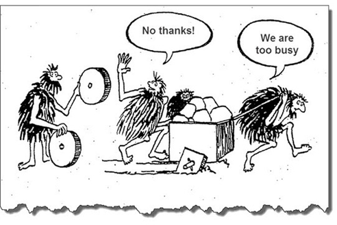
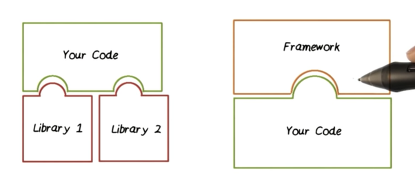
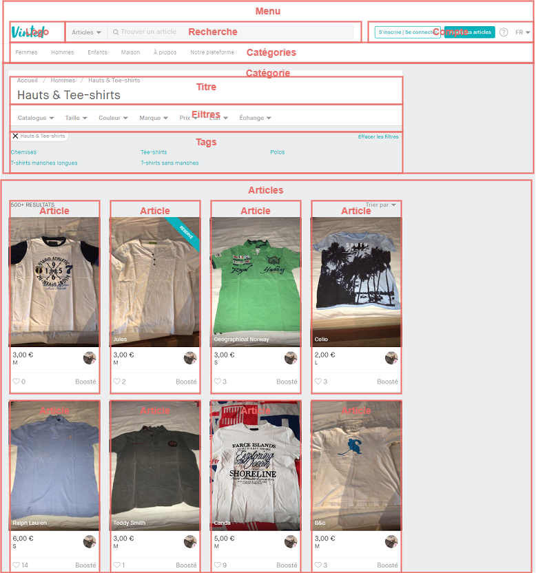
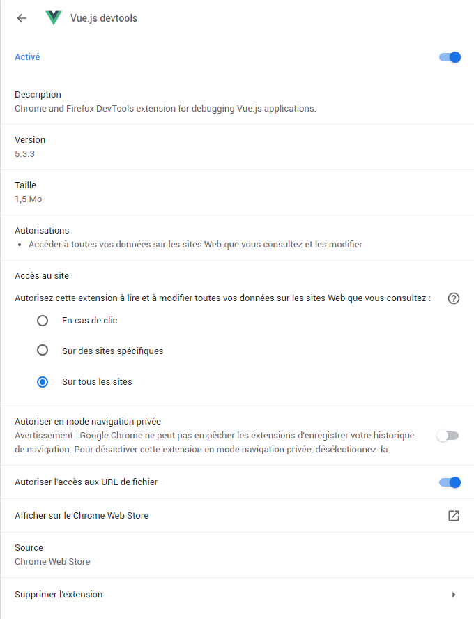
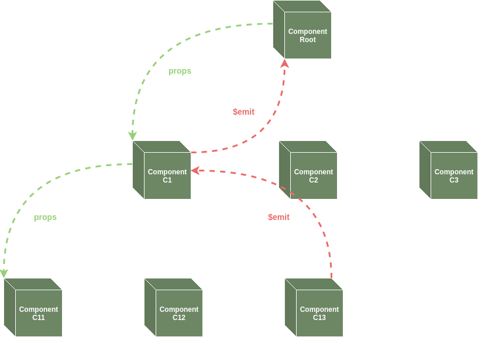
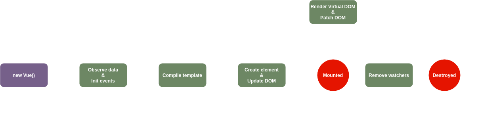
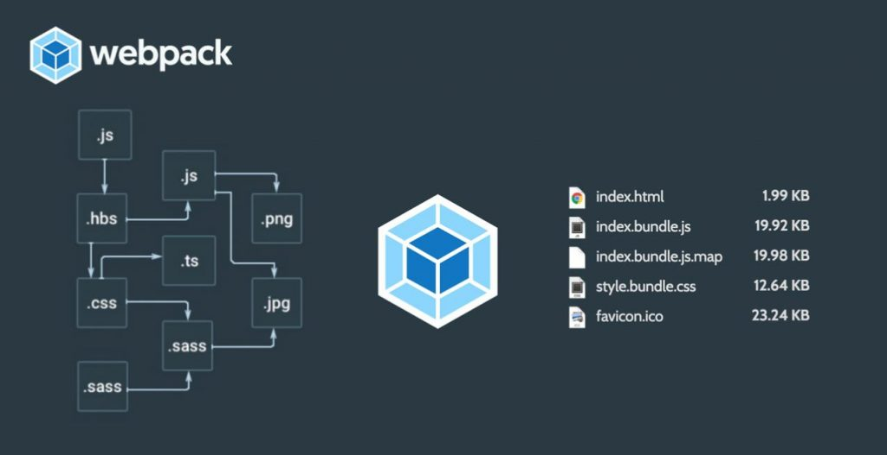

---

theme : "night"
customTheme: "custom"
transition: "slide"
highlightTheme: "monokai"
logoImg: "images/vuejs_logo.png"
slideNumber: false
title: "Vue.js"

---

<!-- Add .vue highlighting-->
<script src="https://cdn.jsdelivr.net/npm/highlightjs"></script>
<script src="https://cdn.jsdelivr.net/npm/highlightjs-vue"></script>
<script>
  hljs.registerLanguage("vue", window.hljsDefineVue);
  hljs.initHighlightingOnLoad();
</script>

# Vue.js


--

## Plan

|           | Module                                       | Cours   | TD     |
| :-------: |  ------------------------------------------- | :-----: | :----: |
| 01        | Introduction                                 | 1h      | 1h     |
| 02        | Les Bindings et les interactions utilisateur | 1h      | 1h     |
| 03        | Les composants                               | 1h      | 1h     |
| 04        | Mise à l'échelle                             | 1h      | 1h     |
| 05        | La navigation et les tests                   | 1h      | 1h     |
| **Total** |                                              | **5h**  | **5h** |

---

## Module 01
### Introduction

--

### Quelques définitions...

--

#### JavaScript


Un langage de programmation principalement pour le navigateur

<small>Mais ça, vous le savez déjà !</small>
<br>
<small>;)</small>

--

#### Les bibliothèques de code
[library](https://en.wikipedia.org/wiki/Library_(computing))

Un ensemble de fonctions d'un domaine fonctionnel particulier

pour gagner du temps et éviter de "réinventer la roue"

- Une librairie de gestion du temps (dates, heures, fuseaux...)
- Une librairie pour envoyer des mails
- Une librairie pour représenter de jolis graphiques...



--

#### Les Frameworks
[framework](https://en.wikipedia.org/wiki/Software_framework)

Un cadre pour développer de manière structurée \
(homogénéité, bonnes pratiques...) :

- Un framework de devéloppement d'applications web
- Un framework de devéloppement d'applications mobile
- ...

--

#### Quelle différence entre une librairie et un framework ?

Le code de votre application **appelle** les fonctions d'une librairie

Le code de votre application **est appelé** par le framework



--

#### Applications Web Mono Pages ?
[Single Page Application](https://en.wikipedia.org/wiki/Single-page_application)

1 seule page Web est chargée dans le navigateur

dynamiquement réécrite en fonction des interactions utilisateur

- Exemples d'applications "classique" :
    - [Amazon](https://www.amazon.fr)
    - [Lemonde](https://www.lemonde.fr)

- Exemples d'applications "SPA" :
    - Cette magnifique présentation :)
    - [Gmail](https://mail.google.com)
    - [Twitter](https://twitter.com)
    - [Deezer](https://www.deezer.com)

--

#### Open-Source ?

Logiciels dont la licence permet :

- La libre redistribution

- L'accès au code source

- La création de travaux dérivés (fork)

<br>


--

### Vue.js ?

<br><br><br>

<small>Ca se prononce "View"</small>
<br>
<small>;)</small>

--

#### En une (longue) phrase ?


Un projet [JavaScript](https://www.w3.org/standards/webdesign/script.html)
[Open-Source](https://opensource.org/) 

qui peut être utilisé

comme une simple [librarie](https://en.wikipedia.org/wiki/Library_(computing))
ou un [framework](https://en.wikipedia.org/wiki/Software_framework) complet

pour construire des [Applications Web Monopages](https://en.wikipedia.org/wiki/Single-page_application)

--

#### Historique

Créé en 2014
par [Evan You](https://evanyou.me/)


Après avoir utilisé [Angular.js](https://angularjs.org/)
chez Google

> "What if I could just extract the part that I really like about Angular
and build something really lightweight..."

--

#### Qui d'autre ? <small>Tendance (perso) 2020...</small>


[React.js](https://reactjs.org/)
[Vue.js](https://vuejs.org/)
[Svelte](https://svelte.dev/)<small>NEW!</small>
[Angular](https://angular.io/)


--

### Concepts principaux

--

#### Model - View - ViewModel
[MVVM](https://en.wikipedia.org/wiki/Model%E2%80%93view%E2%80%93viewmodel)

Architecture qui permet de séparer

- La **vue** (interface Graphique)

- Du **modèle** (les données et leur manipulation : DB, API...)

- Le "ViewModel" assure la glue entre les 2 via du "data-binding"


--

#### Composant Graphique

<br>

Permet de diviser l'**Interface Graphique**

en éléments **indépendants** et **réutilisables**

<br>

Permet de concevoir chaque élément de manière **isolée**

--

#### Composition : exemple



--

#### DOM virtuel : la problématique

Avec le data-binding, chaque changement d'état \
provoque une cascade d'appels à l'API du DOM


```javascript
document.getElementsByClassName("list__item")[0].textContent = "List item one";
const listItemTwo = document.createElement("li");
listItemTwo.classList.add("list__item");
listItemTwo.textContent = "List item two";
document.getElementsByClassName("list")[0].appendChild(listItemTwo);
```

Ces appels sont couteux et beaucoup d'entre eux sont inutiles

--

#### DOM virtuel : qu'est-ce que c'est ?

Une copie en mémoire du véritable DOM

Lors des changements d'état, seul le DOM virtuel est muté

La différence entre les 2 DOMs est calculée et appliquée en 1 fois au véritable DOM


--

### Démarrage

--

#### Inclure la librairie Vue.js dans une page Web

```vue
<!DOCTYPE html>
<html>

    <head>

        <!-- Dev version -->
        <script src="https://cdn.jsdelivr.net/npm/vue/dist/vue.js"></script>

        <!-- Or optimized prod version -->
        <script src="https://cdn.jsdelivr.net/npm/vue"></script>

    </head>

    <body></body>

</html>
```

--

#### Instancier Vue.js

```vue
<!DOCTYPE html>
<html>

    <head>

        <script>

            const app = new Vue({

                // Selecteur CSS indiquant l'élément auquel attacher l'application
                el: '#myFirstVueApp'

            });
        </script>

    </head>

    <body>

        <h2>Ma 1ère app vue.js</h2>

        <div id="myFirstVueApp"></div>

    </body>

</html>
```

--

#### Ajouter de la donnée

```vue
<!DOCTYPE html>
<html>
    <head>
        <script>
            const app = new Vue({
                el: '#myFirstVueApp',
                data: {
                    message: 'Hello world!',
                }
            });
        </script>

    </head>
    <body>
        <h2>Ma 1ère app vue.js</h2>
        <div id="myFirstVueApp">

            <!-- 
                Vue.js utilise un language de template
                pour remplacer {{ }} par le contenu au runtime
            -->
            {{ message }}

        </div>
    </body>
</html>
```

--

### L'écosystème Vue.js

--

#### Deboguage
[vue-devtools](https://github.com/vuejs/vue-devtools)

Extension navigateur (Chrome, Firefox) \
pour faciliter le deboguage


--

#### Création d'un nouveau projet
[vue-cli](https://cli.vuejs.org/)

Outil (CLI) qui propose aussi une interface graphique

```bash
npm install -g @vue/cli

# Créer une nouvelle appli en ligne de commande
vue create my-awesome-vue-app

# Créer une nouvelle appli via l'interface graphique
vue ui
```


--

#### Gestion des composants au format `.vue`
[vue-loader](https://vue-loader.vuejs.org/)

Permet de transformer des fichiers .vue en code JavaScript interprétable par le navigateur

```vue
<!-- Exemple de composant myComponent.vue -->

<!-- Template du composant -->
<template>
    <div class="example">{{ msg }}</div>
</template>

<!-- Code JavaScript du composant -->
<script>
    export default {
        data () {
            return {
                msg: 'Hello world!'
            }
        }
    }
</script>

<!-- Style du composant -->
<style>
    .example {
        color: red;
    }
</style>
```

--

### L'interpolation

--

#### Syntaxe "Moustache"
[{{ }}](https://vuejs.org/v2/guide/syntax.html#Interpolations)

```vue
<script>
    const app = new Vue({
        el: '#myFirstVueApp',
        data: {
            now: undefined,
        },
    });

    // Met à jour la variable now toutes les secondes
    setInterval(() => app.$data.now = new Date().toString(), 1000)

</script>

<div id="app">

    <!--
        effectue un binding directionnel entre
            - l'expression JavaScript
            - son rendu dans la page sous forme d'HTML
    -->
    <span>Il est {{ now }} </span>

</div>
```

--

### Les directives

--

#### Qu'est-ce qu'une directive ?

Un attribut HTML compréhensible par Vue.js

Il est préfixé par `v-`

```vue
<!-- Exemples de directives -->

<span v-show="toBeVisible">


<span v-if="toBeVisible">


<span v-bind:title="message">
```

--

#### Binder un attribut
[`v-bind`](https://vuejs.org/v2/api/#v-bind)

```vue
<script>
    const app = new Vue({
        el: '#app',
        data: {
            mySuperTitle: 'Super, non ?',
        },
    });

</script>

<div id="app">

    <!-- A ne pas faire... CA NE MARCHE PAS !! ;) -->
    <!-- Il n'est pas possible d'utiliser la syntaxe mustache dans un attribut HTML -->
    <span title="{{ mySuperTitle }}">


    <!-- Il faut utiliser la directive v-bind:$attribut à la place -->
    <span v-bind:title="mySuperTitle">


    <!-- v-bind peut être écrit avec la syntaxe abrégée :$attribut  -->
    <span :title="mySuperTitle">

</div>
```

--

#### Binder des attributs de style
[`class and style binding`](https://vuejs.org/v2/guide/class-and-style.html)

```vue
<script>
    const app = new Vue({
        el: '#app',
        data: {
            isActive: true,
            hasError: false,
            activeColor: 'red',
            fontSize: 30
        },
    });

</script>

<div id="app">


    <!-- Binder la propriété style (inline style) -->
    <span :style="{ color: activeColor, fontSize: fontSize + 'px' }"></span>


    <!-- Binder des classes CSS -->
    <span :class="{ active: isActive, 'text-danger': hasError }"></span>


</div>
```

--

#### Afficher un élément de manière conditionnelle
[`v-show`](https://vuejs.org/v2/api/#v-show)


```vue
<script>

const app = new Vue({
    el: '#app',
    data: {
        seen: true
    }
});

</script>

<div id="app">

    <!--
        v-show "bind" la propriété seen
        pour conditionner la visibilité de l'élément
    -->
    <span v-show="seen">Now you see me</span>

</div>
```

--

#### Créer un élément de manière conditionnelle
[`v-if`](https://vuejs.org/v2/api/#v-if)
[`v-else`](https://vuejs.org/v2/api/#v-else)
[`v-else-if`](https://vuejs.org/v2/api/#v-else-if)

```vue
<script>

const app = new Vue({
    el: '#app',
    data: {
        seen: 'B'
    }
});

</script>

<div id="app">


    <!-- expression (booleen) pour conditionner la présence de l'élément -->
    <span v-if="seen === 'A'">It's an A</span>


    <!-- v-else-if peut être chainé -->
    <span v-else-if="seen === 'B'">It's a B</span>


    <!-- v-else est la négation des v-if / v-else-if qui le précèdent -->
    <span v-else>I dont know what it is...</span>


</div>
```

--

#### Afficher une liste d'éléments
[`v-for`](https://vuejs.org/v2/api/#v-for)

```vue
<script>

const app = new Vue({
    el: '#app',
    data: {
        items: [
            { message: 'Foo', id: 0 },
            { message: 'Bar', id: 1 },
        ]
    }
});

</script>

<div id="app">

    <!--
        v-for prend pour valeur alias in iterable
        un itérable peut être un Array, un Object, un String...)
        la directivee key permet d'indiquer ce qui rend l'élément unique
    -->
    <li v-for="item in items" :key="item.id">
        {{ item.message }}
    </li>

</div>
```

--

#### Afficher du HTML
[`v-html`](https://vuejs.org/v2/api/#v-html)

```vue
<script>

const app = new Vue({
    el: '#app',
    data: {
        rawHtml: '<p style="color: red;">Hello!</p>'
    }
});

</script>

<div id="app">


    <span v-html="rawHtml"></span>


</div>
```

--

### Labs


--

### lab/01/01
#### Récupérer le contenu de la formation

1. Installer [Git](https://git-scm.com/)

2. Créer un compte sur [Github](https://github.com)

3. Communiquer l'adresse email du compte créé

4. Cloner le dépôt Git de la formation ([github.com/fmartinou/training-vuejs](https://github.com/fmartinou/training-vuejs))

5. Ouvrir la présentation `training-vuejs/course/index.html`

--

### lab/01/02
#### Installer et configurer l'IDE

1. Télécharger et installer [Visual Studio Code](https://code.visualstudio.com/)

2. Installer les extensions suivantes
    * [ESLint](https://marketplace.visualstudio.com/items?itemName=dbaeumer.vscode-eslint)
    * [Vetur](https://marketplace.visualstudio.com/items?itemName=octref.vetur)

3. Ouvrir le repo Github de la formation dans Visual Studio Code

--

### lab/01/03
#### Installer l'extension Vue.js Devtools

1. Télécharger et installer [Google Chrome](https://www.google.com/chrome)

2. Installer l'extension [Vue.js devtools](https://chrome.google.com/webstore/detail/vuejs-devtools/nhdogjmejiglipccpnnnanhbledajbpd) et la configurer :
    - [Ouvrir les paramètres de l'extensions](chrome://extensions/?id=nhdogjmejiglipccpnnnanhbledajbpd)
    - Activer "`Autoriser l'accès aux URL de fichier`"



--

### lab/01/04
#### Explorer une application Vue.js

1. Ouvrir le fichier lab/01/04/index.html dans le navigateur

2. Créer quelque "todos"

3. Ouvrir l'extension Vue.js Devtools

4. Modifier les "todos" dans la console (sous `data`)

5. Et observer le binding fonctionner
    - title
    - completed
    - ajout, suppression...

--

### lab/01/05
#### 1ère application Vue.js

1. Ouvrir le fichier lab/01/05/index.html dans le navigateur

2. Une liste de films est disponible dans la variable movies
    - (regarder le fichier movies.js)

3. Afficher tous les films sous forme d'une liste à puces

4. Modifier pour que les films non encore sortis soient affichés en rouge

5. Modifier pour n'afficher que les films dont la note est supérieure à 2

---

## Module 02
### Les Bindings et les interactions utilisateur

--

### Les Bindings

--

#### L'instance et son contexte réactif
[vue instance](https://vuejs.org/v2/guide/instance.html)

```vue
<script>
const app = new Vue({ // 1 instance de Vue est créé et assignée à la variable app
    el: '#app',

    // Les données 'bindées' sont dans l'objet data
    data: {
        myData1: 'a string',
        myData2: 'another string',
    }
});

// Les données peuvent être accédées directement sur l'instance
console.log(app.myData1); // Output -> 'a string'

// Les données peuvent être modifiées (entraine une mise à jour de l'affichage)
app.myData1 = 'Surprise!'; 

// Attention : les propriétés ajoutées dynamiquement ne seront pas réactives !
app.noWayImNotReactive = 'Hello!';
app.noWayImNotReactive = 'Hello?';
app.noWayImNotReactive = 'Hello???';
</script>

<div id="app">
    <div>{{ myData1 }}</div>
    <div>{{ noWayImNotReactive }}</div>
</div>
```

--

#### Limites de l'objet `data`

Comment faire si je veux afficher le message avec la 1ère lettre en majuscule ?

```vue
<script>

    const app = new Vue({
        el: '#app',
        data: {
            message: 'hello world!',
        },
    });

</script>

<div id="app">

    <span>{{ message.charAt(0).toUpperCase() + message.slice(1) }}</span>
</div>
```

Il faut éviter de mettre trop de logique dans les templates !

--

#### Les propriétés calculées
[computed](https://vuejs.org/v2/guide/computed.html)

```vue
<script>
    const app = new Vue({
        el: '#app',
        data: { message: 'hello world!' },

        // Les propriétés calculées sont dans l'objet computed
        computed: {
            messageCapitalized: function() {

                // this est l'objet app
                return this.message.charAt(0).toUpperCase() + message.slice(1);
            }
        }
    });

    // Peut être accédée comme une propriété standard mais ne peut pas être modifiée
    console.log(app.messageCapitalized);    // Output -> 'Hello world!'
    app.messageCapitalized = 'Surprise';              // Renvoie une Erreur

    // Si message est modifié, l'affichage de messageCapitalized va être mis à jour
    app.message = 'Coucou le monde !';
</script>

<div id="app">
    <span>{{ messageCapitalized }}</span>
</div>
```

--

#### Les propriétés calculées avec setter
[computed setter](https://vuejs.org/v2/guide/computed.html#Computed-Setter)

```vue
<script>
    const app = new Vue({
        el: '#app',
        data: { firstName: 'John', lastName: 'Doe' },

        computed: { // la propriété est un objet qui contient 2 fonctions get & set
            fullName: {

                get: function() {
                    return this.firstName + ' ' + this.lastName;
                }

                set: function (newValue) {
                    const names = newValue.split(' ');
                    this.firstName = names[0];
                    this.lastName = names[names.length - 1];
                }
            }
        }
    });

    console.log(app.fullName);          // Le getter sera invoqué 
    app.fullName = 'John McClane';      // Le setter sera invoqué

</script>

<div id="app"><span>{{ fullName }}</span></div>
```

--

#### Les Observateurs
[watchers](https://vuejs.org/v2/guide/computed.html#Watchers)

```vue
<script>
    const app = new Vue({
        el: '#app',
        data: { message: 'Hello world!' },

        watch: {

            // Invoque la fonction à chaque fois que la propriété 'message' change
            message: function(oldMessage, newMessage) {
                if (oldMessage === newMessage) {
                    displayMessage('Seriously? Are you kidding?');
                }
            }
        }
    });
</script>

<div id="app">
    <span>{{ message }}</span>
</div>
```

--

#### Les méthodes
[methods](https://vuejs.org/v2/api/#methods)

```vue
<script>
    const app = new Vue({
        el: '#app',
        data: { weird: 'Weird!' },

        methods: {

            doSomethingWeird: function() {

                // this référence l'application app
                myWeirdApi.run(this.weird);

            },

            saveUser: function(user) {

                myUserApi.save(user);

            }
        }
    });
</script>

<div id="app"><button @click="doSomethingWeird()">Click me!</button></div>
```

--

### Les événements

--

#### Ecouter des événements
[v-on](https://vuejs.org/v2/api/#v-on)

```vue
<script>
    const app = new Vue({ el: '#app' });
</script>

<!-- Exemple classique (sans vue) -->
<button onclick="alert('Hello!');">Click me!</button>

<div id="app">

    <!--
        Exemple avec vue
        Syntaxe est v-on:eventName
    -->
    <button v-on:click="alert('Hello!');">Click me!</button>

</div>
```

--

#### Appeler un handler
[v-on handler](https://vuejs.org/v2/guide/events.html#Method-Event-Handlers)

```vue
<script>
    const app = new Vue({
        el: '#app',
        methods: {

            // Le handler fait partie des methods
            // Il prend en paramètre l'événement natif provenant du DOM
            callMeOnButtonClick: function(event) {

                console.log(event);

            }
        }
    });
</script>

<div id="app">

    <!-- il est possible de donner une référence de méthode -->
    <button v-on:click="callMeOnButtonClick">Click me!</button>

    <!-- il est possible d'exécuter la méthode directement -->
    <button v-on:click="callMeOnButtonClick($event)">Click me!</button>

</div>
```

--

#### Syntaxe courte
[@](https://vuejs.org/v2/api/#v-on)

```vue
<script>
    const app = new Vue({ el: '#app' });
</script>

<div id="app">

    <!-- Syntaxe classique -->
    <button v-on:click="alert('Hello!')">Click me!</button>

    <!-- Syntaxe courte -->
    <button @click="alert('Hello!')">Click me!</button>

</div>
```

--

#### Les modificateurs
[modifiers](https://vuejs.org/v2/guide/events.html#Event-Modifiers)

```vue
<script>
    const app = new Vue({ el: '#app' });
</script>

<div id="app">

    <!--
        .stop est un modifier
        qui appelle event.stopPropagation() sur l'événement natif
    -->
    <button @click.stop="alert('Hello!')">Click me!</button>

    <!--
        .prevent est un modifier
        qui appelle event.preventDefault() sur l'événement natif
    -->
    <button @click.prevent="alert('Hello!')">Click me!</button>


    <!--
        .once est un modifier
        l'événement sera déclenché (au plus) 1 fois
    -->
    <button @click.once="alert('Hello!')">Click me!</button>

</div>
```

--

#### Les événements du clavier
[keyboard modifiers](https://vuejs.org/v2/guide/events.html#Key-Modifiers)

```vue
<script>
    const app = new Vue({ el: '#app' });
</script>

<div id="app">

    <!-- event sur toutes les touches -->
    <input v-on:keyup="submit">

    <!-- event sur touche PageDown -->
    <input v-on:keyup.page-down="submit">

    <!-- event sur combinaison de touches Alt + C -->
    <input v-on:keyup.alt.67="submit">

    <!-- event sur combinaison Ctrl + Click -->
    <input v-on:click.ctrl="submit">

</div>
```

Vue fournit des alias pour les codes touches communs

`
enter
tab
delete
esc
space
up
down
left
right
`

--

#### Les événements de la souris
[mouse modifiers](https://vuejs.org/v2/guide/events.html#Mouse-Button-Modifiers)

```vue
<script>
    const app = new Vue({ el: '#app' });
</script>

<div id="app">

    <!-- event sur tous les clics -->
    <button v-on:click="submit">Click me!</button>

    <!-- event sur clic gauche -->
    <button v-on:click.left="submit">Click me!</button>

    <!-- event sur clic droit -->
    <button v-on:click.right="submit">Click me!</button>

    <!-- event sur clic du milieu -->
    <button v-on:click.middle="submit">Click me!</button>

</div>
```

--

### Binding bidirectionnel

--

#### Sans binding bidirectionnel...

```vue
<script>
    const app = new Vue({
        el: '#app',
        data: {
            myValue: 'Hello!',
        },

        methods: {
            updateMyValue: function(event) {
                this.message = event.target.value;
            }
        }
    });
</script>

<div id="app">

    <!--
        Binding data.myValue -> input.value
        Event input.change   -> updateMyValue
    -->
    <input type="text" :value="myValue" @input="updateMyValue">

</div>
```

--

#### Avec binding bidirectionnel...
[v-model](https://vuejs.org/v2/api/#v-model)

```vue
<script>
    const app = new Vue({
        el: '#app',
        data: {
            myValue: 'Hello!',
        },
    });
</script>

<div id="app">

    <!--
        Binding data.myValue -> input.value
        Binding input.value  -> data.myValue
    -->
    <input type="text" v-model="myValue">

    <!--
        v-model fonctionne pour les éléments :

            - <input type="text">     (propriété value / événement input)
            - <input type="checkbox"> (propriété checked / événement change)
            - <textarea>              (propriété value / événement input)
            - <select>                (propriété value / événement change)
    -->

</div>
```

--

#### Binding bidirectionnel Text

```vue
<script>
    const app = new Vue({
        el: '#app',
        data: {
            myValue: 'Hello!',
        },
    });
</script>

<div id="app">

    <input type="text" v-model="myValue">

    <textarea v-model="myValue"><textarea>

</div>
```

--

#### Binding bidirectionnel Case à cocher

```vue
<script>
    const app = new Vue({
        el: '#app',
        data: {
            myValue: true,
        },
    });
</script>

<div id="app">

    <!-- myValue est un booléen -->
    <input type="checkbox" v-model="myValue">

</div>
```

--

#### Binding bidirectionnel Groupe de Cases à cocher

```vue
<script>
    const app = new Vue({
        el: '#app',
        data: {
            myValue: ['A', 'C'],
        },
    });
</script>

<div id="app">

    <!-- myValue est un tableau -->
    <input type="checkbox" v-model="myValue" value="A">
    <input type="checkbox" v-model="myValue" value="B">
    <input type="checkbox" v-model="myValue" value="C">

</div>
```

--

#### Binding bidirectionnel Boutons Radio

```vue
<script>
    const app = new Vue({
        el: '#app',
        data: {
            myValue: 'B',
        },
    });
</script>

<div id="app">

    <!-- myValue est une String -->
    <input type="radio" v-model="myValue" value="A">
    <input type="radio" v-model="myValue" value="B">
    <input type="radio" v-model="myValue" value="C">

</div>
```

--

#### Binding bidirectionnel Liste de choix

```vue
<script>
    const app = new Vue({
        el: '#app',
        data: {
            myValue: 'B',
        },
    });
</script>

<div id="app">

    <!-- myValue est une String -->
    <select v-model="myValue">
        <option>A</option>
        <option>B</option>
        <option>C</option>
    </select>

</div>
```

--

#### Binding bidirectionnel Liste de choix (custom value)

```vue
<script>
    const app = new Vue({
        el: '#app',
        data: {
            myValues: [
                { code: 'A', display: 'A is awesome' },
                { code: 'B', display: 'B is awesome' },
                { code: 'C', display: 'C is awesome' }
            ],
            myValue: { code: 'A', value: 'A is awesome' },
        },
    });
</script>

<div id="app">

    <select v-model="myValue">
        <!--
            La propriété display est affichée
            La valeur du select est l'object complet
            (avec propriétés code & display)
        -->
        <option v-for="value in values" :value="value">{{ value.display}}</option>

    </select>

</div>
```

--

#### Binding bidirectionnel Liste de choix multivaluée

```vue
<script>
    const app = new Vue({
        el: '#app',
        data: {
            myValue: ['A', 'C'],
        },
    });
</script>

<div id="app">

    <!-- myValue est un tableau -->
    <select v-model="myValue" multiple>
        <option>A</option>
        <option>B</option>
        <option>C</option>
    </select>

</div>
```

--

### Les filtres

--

#### Créer un filtre
[a | b](https://vuejs.org/v2/guide/filters.html)

```vue
<script>
    const app = new Vue({
        el: '#app',
        data: { myValue: 'hello world!' },

        filters: {
            capitalize: function (value) {
                return value.charAt(0).toUpperCase() + value.slice(1);
            }, 

            lol: function (value, extra) {
                return `${value} ${extra}!!!`;
            }, 
        }
    });
</script>

<div id="app">

    <!-- Les filtres sont chainés avec des pipes (comme unix) -->
    <div>{{ myValue | capitalize | lol }}</div>

    <!-- Les filtres sont aussi utilisables dans les directives -->
    <input :value="myValue | capitalize | lol('extra')">
</div>
```

--

### Labs


--

### lab/02/01
#### Implémenter une librairie en ligne...

```md
- Catalogue
    - Affichage liste de catégories (Policier, SF...)
    - Affichage liste de livres en fonction de la catégorie
    - Ajout des livres au panier (pas de doublons)

- Panier
    - Affichage articles commandés
    - Affichage total du panier
    - Suppression possible (croix rouge)

- Contact
    - Saisie des infos client (nom, prénom...)
    - Affichage liste des pays supportés

- Bouton payer
    - Accessible si au moins 1 article dans le panier
    - Accessible si toutes les infos du contact sont renseignées
    - Au clic, le panier et les coordonnées sont vidées
```

--

### lab/02/01
#### Tips

```md
- Une variable globale contient le catalogue (voir data.js)
    - categories

- Une variable globale contient les pays (voir data.js)
    - countries

- Pour trier des objets par rapport à une prop a -> z (categories...)
    - Regarder la fonction String.prototype.localeCompare...

- Pour formatter les prix
    - Regarder la fonction Number.prototype.toFixed...

- Pour supprimer un élément d'un tableau
    - Regarder la fonction Array.prototype.splice...

- Pour activer /désactiver un bouton
    - Regarder la propriété disabled de l'élément HTML button...
```

---

## Module 03
### Les Composants

--

### Rappel

Eléments **indépendants** et **réutilisables**


--

### Créer des composants avec Vue.js

--

#### Anatomie d'un composant

```javascript
// Un composant est un object JavaScript
const myComponent = {

    // Attention !
    // data est une fonction qui retourne les données à binder
    data: function() {
        return {
            count: 0,
        }
    },

    // un composant peut avoir des methods, computed, watch, filters...
    methods: {
        add: function() {
            this.count++;
        }
    },

    // Définit la template html du composant (sous forme de String)
    template: '<button @click="add">Nb clicks = {{ count }}</button>',

};
```

--

#### Template multi-lignes

```javascript
const myComponent = {

    data: function() {
        return {
            count: 0,
        }
    },

    methods: {
        add: function() {
            this.count++;
        }
    },

    // template définie dans un littéral de gabarit JavaScript (`toto ${toto}`)
    template: `
        <div class="toto">
            <div class="tutu">
                <button @click="add">Nb clicks = {{ count }}</button>
            </div>
        </div>
    `,
};
```

--

#### Enregistrer et Utiliser un composant
[registration](https://vuejs.org/v2/guide/components-registration.html)

```vue
<!DOCTYPE html>
<html>
    <head>
        <script>
            // Des composants Vue.js
            const MyComponent      = { ... };
            const MyOtherComponent = { ... };

            const app = new Vue({
                el: '#app',

                // Les composants sont enregistrés avec un nom
                components: {
                    'my-component-is-awesome'        : MyComponent,
                    'my-other-component-is-great-too': MyOtherComponent,
                }
            });
        </script>

    </head>
    <body>
        <div id="app">
            <my-component-is-awesome></my-component-is-awesome>
            <my-other-component-is-great-too></my-other-component-is-great-too>
        </div>
    </body>
</html>
```

--

#### Les instances des composants

Les composants Vue.js sont des
[instances Vue](https://vuejs.org/v2/guide/instance.html)
à part entière

Ils possèdent donc leurs propres \
[data](https://vuejs.org/v2/api/#data) \
[methods](https://vuejs.org/v2/api/#methods) \
[computed](https://vuejs.org/v2/guide/computed.html) \
[watchers](https://vuejs.org/v2/guide/computed.html#Watchers)

--

#### Réutiliser un composant

```vue
<!DOCTYPE html>
<html>
    <head>
        <script>
            const MyComponent = { ... };

            const app = new Vue({
                el: '#app',

                components: {
                    'foo': MyComponent,
                    'bar': MyComponent,
                }
            });
        </script>

    </head>
    <body>
        <div id="app">

            <!-- Chaque composant a sa propre instance (état...)-->
            <foo></foo>
            <bar></bar>

        </div>
    </body>
</html>
```

--

#### Enregistrer un sous-composant

Les composants peuvent être imbriqués

```vue
<html>
    <head>
        <script>
            const MyNestedComponent = { template: '<p>Nested!!!</p>' };

            const MyMainComponent = { 
                components: {
                    nested: MyNestedComponent,
                },
                template: '<p>Main!!!<nested></nested></p>',
            };

            const app = new Vue({
                el: '#app',
                components: {
                    'main': MyMainComponent,
                }
            });
        </script>
    </head>

    <body>
        <div id="app">
            <main></main>
        </div>
    </body>
</html>
```

--

#### Enregistrer un composant global (utilisable partout)
[global](https://vuejs.org/v2/guide/components-registration.html#Global-Registration)

```vue
<html>
    <head>
        <script>

            const MyGlobalComponent = { template: '<p>Global!!!</p>' };

            Vue.component('global', MyGlobalComponent)

            const app = new Vue({
                el: '#app',

                // Les composants globaux n'ont pas besoin d'être enregistrés
                components: {}
            });
        </script>
    </head>
    
    <body>
        <div id="app">

            <global></global>

        </div>
    </body>
</html>
```

--

### La communication entre les composants
#### [`Les props`](https://vuejs.org/v2/guide/components-props.html)

--

#### Passer des propriétés à un composant

```vue
<html>
    <head>
        <script>
            const MyComponent = {

                // Les propriétés attendues en entrée par le composant
                props: ['messageToDisplay'],

                // Les propriétés sont utilisables dans les templates
                template: '<p>{{ messageToDisplay }}</p>'
            };
            
            const app = new Vue({
                el: '#app',
                components: { 'my-component': MyComponent }
            });
        </script>
    </head>
    <body>
        <div id="app">
            <!--
                Les propriétés sont valorisées par les attributs HTML
                CamelCase -> kebab-case
            -->
            <my-component message-to-display="Hello World!"></my-component>
        </div>
    </body>
</html>
```

--

#### Passer des propriétés dynamiques

```vue
<html>
    <head>
        <script>
            const MyComponent = {
                props: [message],
                template: '...'
            };
            
            const app = new Vue({
                el: '#app',
                components: { 'my-component': MyComponent },
                data: {
                    blablaVar: 'Blabla!',
                }
            });
        </script>
    </head>
    
    <body>
        <div id="app">

            <!-- v-bind peut être utilisé dans les props -->
            <my-component v-bind:message="blablaVar"></my-component>
            <my-component       :message="blablaVar"></my-component>
        </div>
    </body>
</html>
```

--

#### Typer les propriétés

```vue
<html>
    <head>
        <script>
            const MyComponent = {
                // Les propriétés peuvent être typées
                // (String, Number, Boolean, Array, Object, Date, Function)
                props: { 
                    message: String,
                    amount:  Number,
                    ok:      Boolean,
                },
            };
            const app = new Vue({ components: { 'my-component': MyComponent } });
        </script>
    </head>
    <body>
        <div id="app">
            <!--
                v-bind doit être utilisé
                pour que Vue invoque une expression JavaScript
                et ne passe pas les Strings '42.21' et 'true'
            -->
            <my-component message="Hello World!" :amount="42.21" :ok="true">
            </my-component>
        </div>
    </body>
</html>
```

--

#### Valider les propriétés

```vue
<html>
    <head>
        <script>
            const MyComponent = {
                props: {
                    message: {
                        type:      String,              // type
                        required:  true,                // obligatoire
                        validator: function(value) {    // fonction de validation
                            value.length > 20
                        },
                    },
                    amount: {
                        type:    Number,
                        default: 100,                   // valeur par défaut
                    },
                },

                template: '...'
            };
        </script>
    </head>
</html>
```

--

#### Le binding des propriétés
[one way data flow](https://vuejs.org/v2/guide/components-props.html#One-Way-Data-Flow)

**Unidirectionnel !**
<br><br>

- Si la valeur de la propriété change dans le composant parent
    - le changement est propagé dans le composant enfant

<br><br>

- Si la valeur de la propriété change dans le composant enfant
    - le changment n'est pas propagé dans le composant parent
    - (Vuejs va logger un warning)

--

### La communication entre les composants
#### [`Les événements`](https://vuejs.org/v2/guide/components-custom-events.html)

--

#### Emettre des événements depuis un Composant
[$emit](https://vuejs.org/v2/api/#vm-emit)

```vue
<html>
    <head>
        <script>
            const MyComponent = {

                template: `
                    <!-- Emettre un événement sans donnée -->
                    <button @click="$emit('my-custom-event')">
                        Click me!
                    </button>

                    <!-- Emettre un événement avec 2 données -->
                    <button @click="$emit('my-custom-event', 'hello', 'world')">
                        Click me!
                    </button>
                `
            };
        </script>
    </head>
</html>
```

<small>Il est préconisé d'utiliser la syntaxe **kebab-case** pour nommer les événements</small>

--

#### Ecouter un événement depuis un composant

Rien ne change...
on utilise toujours
[v-on](https://vuejs.org/v2/api/#v-on) !

```vue
<html>
    <head>
        <script>
            const MyComponent = {
                template: `
                    <button @click="$emit('my-custom-event', 'hi', 'you')">
                        Click me!
                    </button>`
            };
            const app = new Vue({
                components: { 'my-component': MyComponent },
                methods: {
                    displayMessage: function(a, b) {
                        console.log(`${a} ${b}!`);
                    }
                }
            });
        </script>
    </head>
    <body>
        <div id="app">
            <my-component v-on:my-custom-event="displayMessage"></my-component>
            <my-component     @my-custom-event="displayMessage"></my-component>
        </div>
    </body>
</html>
```

--

#### Vue globale de la communication entre les composants



--

### Les slots

--

#### La problématique

un composant générique **Contact** affiche le nom et le prénom \
et peut afficher des propriétés "custom" \
en fonction de son utilisation

```vue
<!-- Dans certains cas, on veut afficher l'adresse-->
<div id="contact1">
    <input name="firstName">
    <input name="lastName">
    <div id="customDetails">
        <input name="street">
        <input name="zipCode">
        <input name="city">
    </div>
</div>

<!-- Dans certains cas, on veut afficher le tel/mail-->
<div id="contact1">
    <input name="firstName">
    <input name="lastName">
    <div id="customDetails">
        <input name="tel">
        <input name="mail">
    </div>
</div>
```

On fait comment ?

--

#### Créer un composant avec un slot

```vue
<html>
    <head>
        <script>
            const MyComponent = {

                template: `
                    <div id="contact1">

                        <input name="firstName">
                        <input name="lastName" >

                        <div id="customDetails">

                            <!-- Emplacement prévu pour le slot -->
                            <slot></slot>

                        </div>
                    </div>
                `
            };
        </script>
    </head>
</html>
```

--

#### Utiliser un composant avec un slot

```vue
<body>
    <div id="app">
        <my-component>

            <!--
                Les children seront créés à la place du <slot></slot>
                de la template de my-component
            -->
            <input name="street" >
            <input name="zipCode">
            <input name="city"   >

        </my-component>
    </div>
</body>
```

--

#### Fournir une valeur par défaut pour le slot

```vue
<html>
    <head>
        <script>
            const MyComponent = {

                template: `
                    <div id="contact1">
                        <input name="firstName">
                        <input name="lastName" >

                        <div id="customDetails">
                            <!--
                                Le slot avec une valeur par défaut
                                (sera écrasé si contenu dans le composant parent)
                            -->
                            <slot>
                                <p>No custom details to display...</p>
                            </slot>
                        </div>
                    </div>
                `
            };
        </script>
    </head>
</html>
```

--

#### Définir un composant avec plusieurs slots
[named slots](https://vuejs.org/v2/guide/components-slots.html#Named-Slots)

```vue
<html>
    <head>
        <script>
            const MyComponent = {

                template: `
                    <div class="container">
                        <header>
                            <slot name="header"></slot>
                        </header>
                        <main>
                            <slot name="main"></slot>
                        </main>
                        <footer>
                            <slot name="footer"></slot>
                        </footer>
                    </div>
                `
            };
        </script>
    </head>
</html>
```

--

#### Utiliser un composant avec plusieurs slots
[v-slot](https://vuejs.org/v2/api/#v-slot)

```vue
<base-layout>
    <template v-slot:header>
        <h1>Here might be a page title</h1>
    </template>

    <template v-slot:main>
        <p>A paragraph for the main content.</p>
        <p>And another one.</p>
    </template>

    <template v-slot:footer>
        <p>Here's some contact info</p>
    </template>
</base-layout>
```

--

### Le cycle de vie d'un composant (simplifié)
[lifecycle](https://vuejs.org/v2/guide/instance.html#Lifecycle-Diagram)



--

### Définir un hook
[hooks](https://vuejs.org/v2/api/#Options-Lifecycle-Hooks)

```javascript
const myComponent = {
    data: function() {
        return {
            ...
        }
    },

    // Les hooks sont définis directement dans le composant
    beforeMount() {
        ...
    },

    mounted() {
        ...
    },

    template: '...',

};
```

--

### Labs


--

### lab/03/01
#### Application modularisée en composants

```md
- L'application (app.js) contient 3 composants
    - catalog
        - responsable pour afficher le catalogue
        - responsable pour ajouter un article

    - cart
        - Responsable pour afficher les articles du panier
        - Responsable pour supprimer un article du panier

    - contact
        - Responsable du formulaire de contact
```

--

### lab/03/01
#### Composant catalog

```md
- Passer la donnée 'categories' de app vers le composant catalog (props)
    - Vérifier que les listes fonctionnent


- Implémenter la fonction emitAddToCart
    - pour émettre un événement 'add-to-cart'
    - passer l'article à ajouter dans l'événement
    - Modifier dans app pour écouter l'événement et appeler la fonction addToCart
    - Vérifier avec la console que l'objet cart se rempli comme prévu
```

--

### lab/03/01
#### Composant cart

```md
- Passer la donnée 'cart' de app vers le composant cart (props)
    - Vérifier que l'ajout / suppression au panier fonctionne
```

--

### lab/03/01
#### Composant contact

```md
- Passer la donnée 'countries' de app vers le composant contact (props)
    - Vérifier que la liste des pays fonctionne


- Implémenter la fonction emitContactChanged
    - pour émettre un événement 'contact-changed'
    - passer le contact dans l'événement
    - Modifier dans app pour écouter l'événement et appeler la fonction onContactChanged
    - Vérifier que le bouton Payer fonctionne
```

---

## Module 04
### mise à l'échelle

--

### Les limitations

--

### Maintenabilité des templates

```javascript
const MyComponent = {

    template: `
        <div id="contact1">
            <input name="firstName">
            <input name="lastName" >
            <div id="customDetails">
                <div id="customDetails">
                    <input name="tel">
                    <input name="mail">
                </div>
            </div>
        </div>
    `
};

```

--

### Erreurs de syntaxe

```javascript
const myData = ['a', 'b', 'c'];

function sortMyData = {

    // Oups... Uncaught ReferenceError : mydata is not defined
    return mydata.sort();
}
```

--

### Compatibilité navigateurs

```javascript
// Ne fonctionne pas sur IE <8
// Ne fonctionne pas sur Safari < 4
// Fonctionne partiellement sur certains IE / Firefox / Safari
// ... :(
window.postMessage({
    hello: 'world',
});
```

--

### Qualité de code

```javascript
// varA n'est jamais utilisée et devrait être supprimée
const varA = 'Hi!';

const varB = 'Hello!' // Il manque un point-virgule à la fin de la ligne

function displayMessage() {
    return varB.toUpperCase();
}

// Un formatage ni fait ni à faire...
    function
mess
 { if
(mess
        ) {
console
.log(
                'dirty');
}
        else {
console.log(
'clean');  }    }
```

--

### Optimisation navigateur

```vue
<!--
    Autant de requêtes HTTP que de scripts
    Chaque composant est un script composé de bytes inutiles (espaces, tabulations...)
-->
<script src="component1.js"></script>
<script src="component2.js"></script>
<script src="component3.js"></script>
<script src="component4.js"></script>
<script src="component5.js"></script>
<script src="component6.js"></script>
<script src="component7.js"></script>
<script src="component8.js"></script>
<script src="component9.js"></script>
<script src="component10.js"></script>
```

--

#### Des outils en JavaScript pour le JavaScript

Des outils existent pour palier ces limitations

<br><br>
Ils sont tous développés en JavaScript 

et fonctionnent sur [Node.js](https://nodejs.org)

--

### Node.js et son éco-système

--

#### Qu'est-ce que Node.js ?

[Node.js](https://nodejs.org)
est un environnement d'exécution JavaScript \
en dehors d'un navigateur Web

Il est basé sur le moteur V8


--

#### Gestionnaire de paquets
[npm](https://www.npmjs.com/)

Node.js inclut un gestionnaire de paquets :\
Node Package Manager (npm)

```bash
# Install express
npm install express

# Install vue-cli
npm install -g @vue/cli
```

--

#### Descripteur de dépendances
[package.json](https://docs.npmjs.com/files/package.json)

permet de lister les dépendances utilisées par un projet

```json
{
    "author": "John Doe",
    "license": "MIT",
    "name": "my-project",
    "description": "A sample Node.js app",
    "version": "1.0.0",
    "main": "index.js",

    "dependencies": {
        "express": "^4.17.1"
    },

    "devDependencies": {
        "@vue/cli": "^4.3.1"
    }
  }
}
```

```bash
# Exécuter npm sur un dossier qui contient un fichier package.json
# Cela va installer toutes les dépendances dans un dossier node_modules/
npm install
```

--

### [Eslint](https://eslint.org/)


--

#### Qu'est-ce que Eslint ?

Un **linter** de code JavaScript

Analyse le code de manière statique (pas d'exécution) \
pour vérifier l'application de règles de codage

Intégré dans les principaux IDE


--

### [Babel](https://babeljs.io/)


--

#### Qu'est-ce que Babel ?

Un transpiler : transforme du code Source en... code Source !

<br><br>

Babel permet \
de coder avec les dernières fonctionnalités JS (ES2015 et +) \
et d'obtenir un code utilisable sur tous les navigateurs souhaités !

```javascript
// Exemple : un code utilisant une fonction fléchée     (ES2015)
[1, 2, 3].map((n) => n + 1);

// L'équivalent après transpilation par Babel           (ES5)
[1, 2, 3].map(function(n) {
  return n + 1;
});
```

--

### [Webpack](https://webpack.js.org/)


--

#### Qu'est-ce que Webpack ?

Un bundler : il assemble et optimise les ressources statiques:
- Elimination de code mort
- Minification du code JavaScript
- Minification des feuilles de style CSS
- Création des Source Maps
- ...



--

### [Vue-loader](https://github.com/vuejs/vue-loader)


--

#### Qu'est-ce que Vue-loader ?

Un loader **Webpack**

<br><br>
qui permet de transformer

des fichiers **.vue** en fichiers **.js** et  **.css**

--

#### Qu'est-ce qu'un fichier .vue ?

Un format permettant d'écrire un composant dans un seul fichier

```vue
<template>
    <div>
        <p> {{ greeting }} World!</p>
        <other-component></other-component>
    </div>
</template>

<script>
    import OtherComponent from './OtherComponent.vue'

    export default {
        components: {
            OtherComponent
        },
        data () {
            return {
                greeting: 'Hello'
            }
        }
    }
</script>

<style>
    p {
        font-size: 2em;
    }
</style>
```

--

### [Vue CLI](https://cli.vuejs.org/)


--

#### Qu'est-ce que Vue CLI ?

Un outil en ligne de commandes \
(Command Line Interface)

pour créer un nouveau projet \
en répondant à quelques questions \
 (boilerplate)


--

#### Installer Vue CLI

```bash
# l'option -g permet d'installer le module en global
# Il va être ajouté au PATH de l'utilisateur
# Et sera utilisable depuis n'importe où
npm install -g @vue/cli
```

--

#### Créer un nouveau projet avec Vue CLI

```bash
vue create hello-world
```

--

### Les Composants .vue

--

#### Créer un composant .vue
[export](https://developer.mozilla.org/fr/docs/Web/JavaScript/Reference/Instructions/export)

```vue
<!-- exemple de fichier hello.vue -->

<!-- template contient la template html du composant -->
<template>
    <div>
        <p> {{ greeting }} World!</p>
    </div>
</template>

<!-- script contient le code JS du composant -->
<script>

    // Tout le code JS est "exporté"
    // pour pouvoir être   "importé" par d'autres composants
    export default {
        data () {
            return {
                greeting: 'Hello';
            }
        }
    }
</script>

<!-- style contient la CSS du composant -->
<style>
    p {
        font-size: 2em;
    }
</style>
```

--

#### Utiliser un composant .vue
[import](https://developer.mozilla.org/fr/docs/Web/JavaScript/Reference/Instructions/import)

```vue
<!-- exemple de fichier app.vue souhaitant utiliser le composant hello.vue -->
<template>
    <div>
        <!-- Utilisation du composant HelloWorld (Attention ! kebab-case !) -->
        <hello-world></hello-world>
    </div>
</template>

<script>

    // Le composant HelloWorld.vue est importé
    import HelloWorld from './HelloWorld.vue';

    export default {
        components: {

            // Le composant HelloWorld est référencé en tant que sous-composant
            HelloWorld,

        },
    }
</script>
```

--

### Labs


--

### lab/04/01
#### Installer L'environnement Node.js

```md
1. Installer node.js (https://nodejs.org/en/)


2. Tester en exécutant la commande `node -v`


3. Tester la console nodejs
    - Exécuter la commande `node`
    - Puis dans la console node, exécuter `console.log('Coucou !')`
    - Pour quitter appuyer sur `CTRL+D`
```

--

### lab/04/02
#### Installer vue-cli

```md
1. Vérifier que npm fonctionne
    - `npm -v`


2. Installer vue-CLI en global
    - `npm install -g @vue/cli`


3. Tester que le CLI fonctionne
    - `vue -V`
```

--

### lab/04/03
#### Créer une nouvelle application

```md
1. Ouvrir un terminal sous lab/04


2. Créer une nouvelle application "hello" avec vue-CLI
    - `vue create hello`
    - default (babel,eslint)
    - ENTREE


3. Déplacer vous sous le répertoire `lab/04/hello` nouvellement créé et exécuter
    - `npm run serve`


4. Ouvrir dans le navigateur l'application Vue créée
    - http://localhost:8080
```

--

### lab/04/04
#### Ajouter un composant Chuck Norris

```md
1. Sous lab/04/hello/src/components
    - Créer un composant ChuckNorris.vue
    - Dans la partie <template>
            <div>
                <h2>Chuck Norris fact...</h2>
            </div>


2. Dans lab/04/hello/src/App.vue
    - Importer le composant ChuckNorris.vue
    - Référencer le composant en tant que sous-composant de app
    - Insérer le composant <chuck-norris /> au dessus du composant <HelloWorld>


3. Vérifier que cela fonctionne
    - vue-serve doit afficher `Compiled successfully in ...ms`
    - rafraichir le navigateur et vérifier que Chuck Norris s'affiche

--

### lab/04/05
#### Implémenter le composant Chuck Norris

```md
1. Copier le fichier lab/04/facts.js 
    - sous lab/04/hello/src/facts.js


2. Copier le fichier lab/04/chuck_norris.jpg
    - sous lab/04/hello/src/assets/chuck_norris.jpg


3. Importer les facts dans app.vue
    - `import facts from "./facts";`


3. Modifier pour passer les facts au composant ChuckNorris
    - passer les facts sous forme de `props` de app vers ChuckNorris


4. Modifier le composant ChuckNorris pour afficher un fact au hasard
    - Utiliser le hook `created`
        - prendre un fact au hasard :
        - `this.facts[Math.floor(Math.random() * this.facts.length)]`
    - Afficher le fact et l'image de Chuck Norris
    <div>
        
        <br>
        <h2>{{ fact }}</h2>
    </div>


5. Supprimer le composant HelloWorld de la page

---

## Module 05
### La navigation & les Tests

--

### La gestion de la navigation

--

#### La problématique


Dans 1 SPA, il y a 1 seul document HTML !

--

#### Les URLs et les Fragments

Dans 1 SPA, il y a 1 seul document HTML...

Pour éviter que le navigateur recharge les pages

on utilise des **fragments**

- https://acme.org/#/catalog
- https://acme.org/#/cart
- https://acme.org/#/signin


--

### [Vue-Router](https://router.vuejs.org/)
Le routeur officiel pour Vue.js

--

#### Ajouter le routeur a une application Vue.js

##### Dans une page HTML
```html
<script src="https://unpkg.com/vue"></script>

<!-- Vue Router doit être inclus après Vue.js -->
<script src="https://unpkg.com/vue-router/dist/vue-router.js"></script>
```

##### Ou avec un système de build

```bash
npm install vue-router
```

```javascript
import Vue from 'vue';

// Vue Router doit être importé après Vue.js
import VueRouter from 'vue-router';

// Il faut indiquer à Vue.js d'utiliser le routeur
Vue.use(VueRouter);
```

--

#### Attacher le routeur à un élément HTML
[router-view](https://router.vuejs.org/api/#router-view)

```html
<div id="app">
    
    <h1>Hello App!</h1>

    <div id="footer">...</div>

    <!-- Le routeur va rendre les "vues" ici -->
    <router-view></router-view>

    <div id="footer">...</div>
</div>
```

--

#### Définir des routes et attacher le routeur à l'application
[routes](https://router.vuejs.org/api/#routes)

```javascript
// On importe les composants Vue.js souhaités
import Page1 from './pages/Page1.vue';
import Page2 from './pages/Page2.vue';
import Page3 from './pages/Page2.vue';

// On associe les composants aux routes (URI Http)
const myRoutes = [
  { path: '/page1', name: 'page1', component: Page1 },
  { path: '/page2', name: 'page2', component: Page2 },
  { path: '/page3', name: 'page3', component: Page3 },
];

// On créé une instance de Routeur en passant les routes
const myRouter = new VueRouter({
  routes: myRoutes,
});

const app = new Vue({

    // A la création de l'instance Vue.js, on attache le routeur
    router: myRouter,

}).$mount('#app');
```

--

#### Accéder aux informations du routeur depuis les composants

```javascript
// Tous les composants peuvent accéder au router avec la propriété $router
this.$router;

// Tous les composants peuvent accéder à la route active avec la propriété $route
this.$route;
```

--

#### Les routes dynamiques
[/route/:dynamic](https://router.vuejs.org/guide/essentials/dynamic-matching.html)

```javascript
const router = new VueRouter({

    routes: [
    
        // La route va matcher /user/0, /user/1...
        { path: '/user/:id', component: User }

    ]
});
```

--

#### Les propriétés des Routes
[route properties](https://router.vuejs.org/api/#route-object-properties)

```md
- path  : le chemin de la route      (/page1)
- name  : le nom de la route         (optionnel)
- params: les paramètres de la route (/user/123)
- query : les query params           (?a=1&b=2)


- Exemple

    - Route = /categories/:category/items/:item


    - https://acme.com/#/categories/123/items/456?sort=asc&new=true

        - $route.path   => /categories/123/items/456
        - $route.params => { category: '123', item: '456' }
        - $route.query  => { sort: 'asc',     new: 'true' }
```

--

#### Ordre d'évaluation des routes
[404](https://router.vuejs.org/guide/essentials/dynamic-matching.html#catch-all-404-not-found-route)

```javascript
// Les routes sont évaluées dans l'ordre
const myRoutes = [
  { path: '/page1', component: Page1 },
  { path: '/page2', component: Page2 },
  { path: '*',      component: PageNotFound }, // * va matcher toutes les routes
];

// Si /page1 -> Page1
// Si /page2 -> Page2
// Si /page3 -> PageNotFound
```

--

#### Routes imbriquées

```javascript
// Composant User avec son propre <router-view>
const User = {
  template: `
    <div class="user">
      <h2>User {{ $route.params.id }}</h2>
      <router-view></router-view>
    </div>
  `
};

const router = new VueRouter({
  routes: [
    { path: '/user/:id', component: User,
      children: [
        
        // UserProfile sera rendu dans le <router-view> de User
        // quand url = /user/:id/profile
        { path: 'profile', component: UserProfile },

        // UserPosts sera rendu dans <router-view> de User
        // quand url = /user/:id/posts
        { path: 'posts', component: UserPosts },

      ]
    }
  ]
});
```

--

#### Gérer la navigation dans les templates
[router-link](https://router.vuejs.org/api/#router-link)

```vue
<div id="app">
  <h1>Hello App!</h1>
  <p>
    <!-- le router-link sera rendu comme un <a href=""> -->
    <router-link to="/page1">Go to Page1</router-link>
    <router-link to="/page2">Go to Page2</router-link>
  </p>

  <router-view></router-view>
</div>
```

--

#### Gérer la navigation en JavaScript
[programmatic navigation](https://router.vuejs.org/guide/essentials/navigation.html)

```javascript
// Dans un composant...


// Naviguer vers le chemin /home
this.$router.push('home')


// Naviguer vers la chemin /home (version objet)
this.$router.push({ path: 'home' })


// Naviguer vers le chemin /register avec le query param ?plan=private
this.$router.push({ path: 'register', query: { plan: 'private' } })


// Naviguer vers la route nommée 'user' avec un param userId
this.$router.push({ name: 'user', params: { userId: '123' } })
```

--

#### Les contrôles de navigation
[navigation guards](https://router.vuejs.org/guide/advanced/navigation-guards.html)

```vue
<script>
module.exports = {
    
    data: function() {return {}},

    beforeRouteEnter (to, from, next) {
        // Appeler avant de changer la route
        // Il faut appeler next() pour confirmer la navigation
    },

    beforeRouteUpdate (to, from, next) {
        // Appeler quand la route change mais le même composant est affiché
        // Ex : /user/1 et /user/2
        // Il faut appeler next() pour confirmer la navigation
    },

    beforeRouteLeave (to, from, next) {
        // Appeler quand la navigation va quitter le composant
        // Il faut appeler next() pour confirmer la navigation
    }
}
</script>

<template>...</template>
```

--

### Les tests

--

#### Typologie de tests


- **Tests Unitaires**
    - Teste qu'un composant fonctionne unitairement
- **Tests d'Intégration**
    - Teste que les composants fonctionnent une fois intégrés
- **Tests de bout-en-bout**
    - Teste que le système fonctionne comme attendu par l'Utilisateur

--

#### Pourquoi tester ?

- Une manière de documenter ce que fait le code

- Evite de restester manuellement après chaque changement

- Evite le risque de régression lors d'ajout de fonctionnalités

- Améliore l'architecture du code

- Facilite le refactoring

- ...

--

#### Tester unitairement un composant Vue.js

Nous avons besoin de :

- Un "Test Runner" pour exécuter les tests : [Jest](https://jestjs.io/)

- Une implémentation "mock" du DOM pour node.js : [JsDom](https://github.com/jsdom/jsdom)

- Des facilités pour manipuler les composants : [Vue Test Utils](https://vue-test-utils.vuejs.org/)

--

#### Exemple de Test Unitaire

```vue
<!-- Exemple de composant Hello.vue -->
<template>
    <span>{{ msg }}</span>
</template>

<script>
    export default {
        props: ['msg'],
    }
</script>
```

```javascript
// Exemple de TU Hello.test.js
import Hello from './Hello.vue';                 // import du composant
import { shallowMount } from '@vue/test-utils';  // import fonction utilitaire

// Définit la suite de tests du composant
describe('Hello', () => {

    // Définit 1 test du composant
    it('should render as expected when called with prop Hello!', () => {
        expect(
            shallowMount(Hello, { propsData: { msg: 'Hello!'} }).text()
        ).toBe('Hello!');
    });

    // Définit 1 test du composant
    it('should render as expected when called with prop Good bye!', () => {
        expect(
            shallowMount(Hello, { propsData: { msg: 'Good bye!'} }).text()
        ).toBe('Good bye!');
    });
});
```

--

#### Tester une application de bout-en-bout

L'objectif est de s'assurer que le comportement est conforme aux attentes de l'Utilisateur.

Il faut donc un véritable navigateur.

Plusieurs frameworks de tests existent et fonctionnent de manière différente :
- Nightwatch (basé sur Selenium)
- Cypress
- TestCafe
- ...

--

#### Exemple de test E2E avec Cypress

```javascript
describe('Testing Acme.com', () => {
    it('Visits the Contact Page', () => {
        cy.visit( 'https://acme.com');
        cy.contains('Contact Us').click();
        cy.url().should('include', '/contact');
    });
});
```

--

### Labs


--

### lab/05/01
#### Routeur

```md
1. Sous lab/05/01, installer les dépendances
    - npm install


2. Démarrer l'application
    - npm run serve


3. Ouvrir l'application et naviguer entre les 3 pages
    - http://localhost:8080/#/page-a
    - http://localhost:8080/#/page-b
    - http://localhost:8080/#/page-c


4. Ajouter une page "PageD"
    - Créer le composant sous /pages
    - Ajouter un lien de navigation dans App.vue
    - Ajouter une route dans router.js qui match /page-d


5. Ajouter dans PageC un <button>Go to PageD</button>
    - Qui navigue vers PageD quand on clique dessus


6. Modifier pour que la route vers PageD contienne un paramètre
    - Modifier la route pour matcher /page-d/:message
    - Modifier PageD pour afficher le message passé dans l'URL
    - Vérifier en appelant http://localhost:8080/#/page-d/hello
    - Modifier PageC en ajoutant un input qui bind une propriété message
    - Modifier le bouton de PageC pour naviguer vers PageD avec le message   
```

--

### lab/05/02
#### Tests E2E avec Cypress

```md
1. Sous lab/05/02/app,
    - installer les dépendances
        - npm install
    - lancer l'application
        - npm start
    - Vérifier en ouvrant http://localhost:3000 dans le navigateur


2. Sous lab/05/02/e2e,
    - installer les dépendances
        - npm install
    - regarder les tests implémentés
        - dans cypress/integration/app.spec.js
    - exécuter les tests
        - npm run cypress:test
    - Vérifier dans le console que tous les tests dont passés


3. Sous lab/05/02/e2e,
    - lancer le debugger Cypress
        - npm run cypress:open
    - dans la fenêtre qui s'est ouverte
        - choisir le navigateur à utiliser en haut à droite
        - cliquer sur app.spec.js en haut à gauche
    - le navigateur s'ouvre et exécute les tests


4. Sous lab/05/02/e2e,
    - modifier les tests et implémenter le test 'Remove book from cart'
        - supprimer un article du panier
        - vérifier que le total est correct
```

---

### The end


